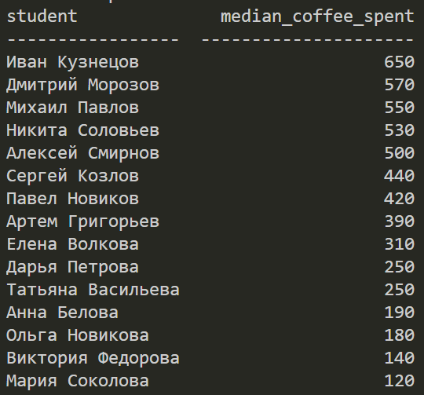
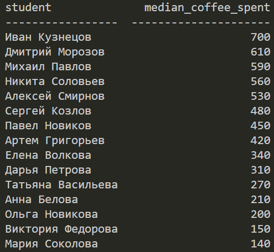
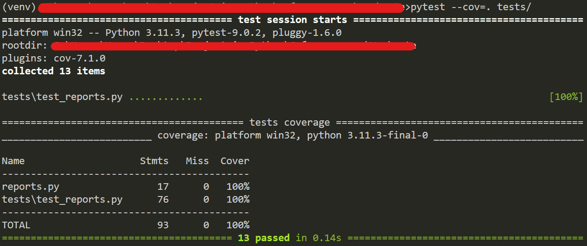

# Coffee Report

Скрипт формирует отчёты по данным о подготовке студентов к экзаменам из CSV-файлов.

## Создание папки venv
```bash
python -m venv venv
```

## Активация папки venv
```bash
venv\Scripts\activate
```

## Установка зависимостей

```bash
pip install -r requirements.txt
```

## Запуск

```bash
# один файл
python main.py --files data/math.csv --report median-coffee

# все три сессии сразу
python main.py --files data/math.csv data/physics.csv data/programming.csv --report median-coffee
```

## После запуска в терминале:
При запуске одного файла в консоль выводится таблица:


При запуске трех файлов в консоль выводится таблица:


## Тесты

```bash
pytest --cov=. tests/
```

## После запуска в терминале:
После запуска теста в терминал выводится:


## Добавление нового отчёта

Зарегистрируйте функцию в `reports.py` через декоратор `@register`:

```python
@register("my-report")
def my_report(rows: list[dict]) -> list[dict]:
    ...
    return [{"column": value, ...}]
```

Новый отчёт сразу доступен через `--report my-report`.

## Файловая структура проекта

| Файл / Папка        | Описание                                                                 |
|---------------------|--------------------------------------------------------------------------|
| `data/`             | CSV-файлы для обработки скриптом                                         |
| `tests/`            | Тесты для проверки функциональности                                      |
| `.coveragerc`       | Исключения для `main.py` и `tests/__init__.py` при запуске coverage      |
| `.gitignore`        | Исключения файлов и папок при выгрузке на GitHub                         |
| `main.py`           | Точка входа: разбор аргументов, чтение CSV, вывод отчёта                 |
| `reports.py`        | Реестр отчётов и их реализации                                           |
| `requirements.txt`  | Зависимости проекта для установки через `pip install -r requirements.txt`|